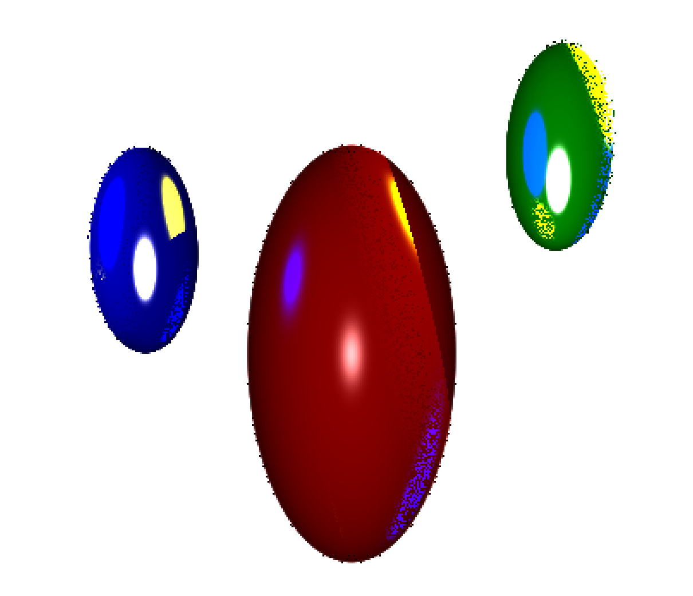

# EECS 3431 - 3D computer graphics Fall 2024 York University, Toronto
Assignment 3: Raytracer

Jessica Corkal & Marius Gebhardt

Email: jcorkal@my.yorku.ca Student ID: 219314095

Email: mmmm@my.yorku.ca Student ID: 221828934

We were able to implement a generic raytracer that generates a ppm image saved to ../out/build/raytracepreset. The program reads in a text file and calculates ray-sphere intersections to draw spheres based on the specified location, scale, and color. It takes into account scene background, lighting, and attempts to render reflection and refraction. We had trouble with the execution of rendering specular reflection. The image shows highlight colors, but doesn't correctly show the specular effect as a gradient / fused with the object's color; we are not sure why.

---------- Learning Resources ----------------

Phong Illumination Model explanation: http://rodolphe-vaillant.fr/entry/85/phong-illumination-model-cheat-sheet

Setting up Windows Subsystem Linux environment for VSCode: https://code.visualstudio.com/docs/cpp/config-wsl

Understanding Raytracing algorithm: https://raytracing.github.io/books/RayTracingInOneWeekend.html#surfacenormalsandmultipleobjects/shadingwithsurfacenormals

Understanding Reflection and Refraction: https://www.scratchapixel.com/lessons/3d-basic-rendering/introduction-to-ray-tracing/adding-reflection-and-refraction.html 

---------- Libraries ----------------

glm: https://github.com/g-truc/glm

Our specular highlights are too bright, we think the color multiplication might be wrong.

Here is our testSample image:

We also didn't have time to look into lights inside spheres.

We used CMake to get dependencies. running `make` worked on our machines, but maybe CMake is required to fetch dependencies (the glm math library)